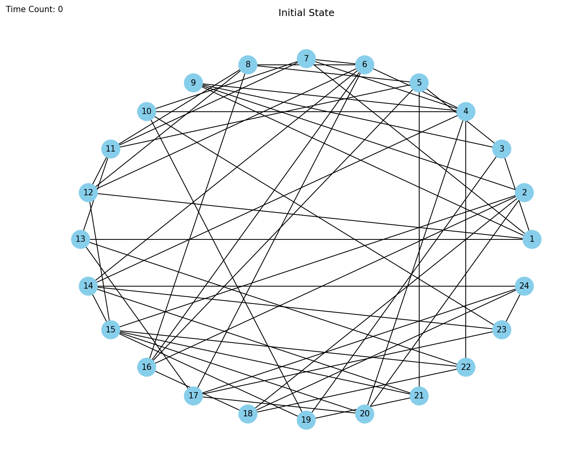
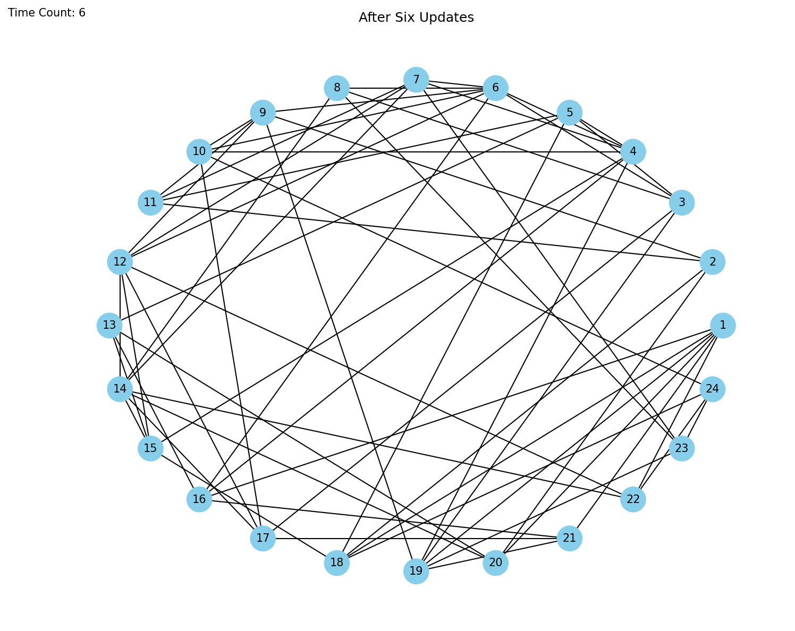
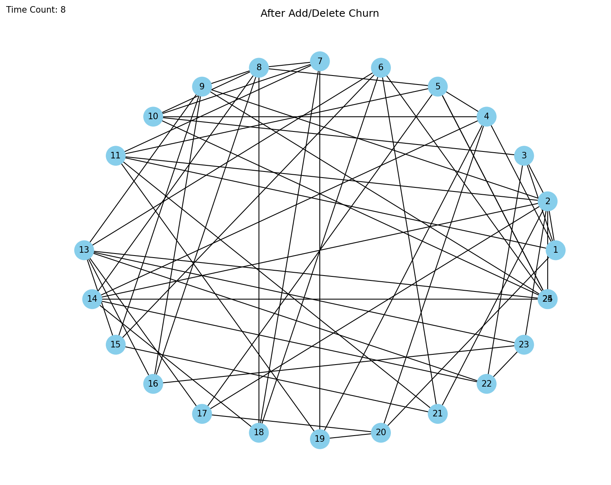

# BitTorrent Simulation

This project simulates core BitTorrent behavior across a peer-to-peer network. Peers exchange file chunks using a simplified tit-for-tat rule, periodically reshuffle preferred connections through optimistic unchoking, and tolerate peer churn through node additions and removals.

The repository started as a single notebook-style script. It is now split into reusable modules, an interactive app entrypoint, and a runnable demo notebook that saves reproducible output snapshots.

## Project Structure

```text
BitTorrentSimulator.py          # Interactive matplotlib app with buttons
BitTorrentSimulationDemo.ipynb  # Reproducible notebook demo that saves artifacts
bittorrent_sim/
  __init__.py
  config.py                     # Simulation constants and tunable parameters
  node.py                       # Peer data model
  simulation.py                 # Network state, chunk exchange, churn, updates
  visualization.py              # Graph layout and snapshot rendering
artifacts/
  snapshot-initial.png
  snapshot-after-updates.png
  snapshot-after-churn.png
```

## Core Pieces

### `SimulationConfig`

`bittorrent_sim/config.py` centralizes the simulation parameters:

- `size_of_file`: number of chunks in the file
- `initial_number_of_nodes`: number of peers at startup
- `peer_optimistic_selection_count`: number of top peers considered during chunk selection
- `total_number_of_connections`: target peer degree
- `optimistically_unchoke_constant`: how often connections are reshuffled

This removes the old hard-coded globals and makes the simulation easier to rerun with different scenarios.

### `Node`

`bittorrent_sim/node.py` defines an individual peer. Each node stores:

- a unique node ID
- a list of connected peers
- the chunks it currently owns
- an upload rate in chunks per update interval

The node class is intentionally small now; most network-wide decisions live in the simulation object instead of relying on global state.

### `BitTorrentSimulation`

`bittorrent_sim/simulation.py` owns the network graph and all state transitions:

- builds the initial population of peers
- chooses high-rate peers to prioritize
- identifies the rarest missing chunk among preferred neighbors
- performs chunk exchange with a simplified tit-for-tat rule
- applies optimistic unchoking
- handles add-node and delete-node churn
- exposes summaries and formatted node rows for debugging

### Visualization

`bittorrent_sim/visualization.py` handles NetworkX rendering and snapshot export:

- `build_layout()` creates the graph layout
- `refresh_axis()` redraws the interactive window
- `save_snapshot()` renders a PNG for documentation or analysis

## How the Simulation Works

At a high level:

1. The network starts with a set of peers, each seeded with a random subset of chunks and a random upload rate.
2. Each peer forms a bounded number of connections to other peers.
3. On every update, a peer looks at its best connected peers, finds the rarest chunk it is missing, and downloads it.
4. In return, it uploads one of its own chunks back to the provider, approximating tit-for-tat behavior.
5. Every few updates, optimistic unchoking reshuffles connections so peers can escape poor local neighborhoods.
6. New peers can join with no chunks, and existing peers can leave at random to simulate churn.

Completed peers are colored green in the visualization.

## Assumptions

For practicality, the model makes several simplifying assumptions:

- TCP, UDP, IP, and transport-level behavior are not simulated
- files are already split into clean, fixed chunks
- upload rates are randomly assigned per peer
- initial peers begin with a small random chunk subset, while newly added peers start empty
- node identity and lookup are tracked directly in memory instead of using a DHT
- download capacity is tied directly to upload rate, which simplifies true BitTorrent dynamics

## Running the Project

### Interactive App

Run the original interactive simulator:

```bash
uv run BitTorrentSimulator.py
```

The UI includes buttons for:

- `Print Nodes`
- `Update`
- `Add Node`
- `Delete Node`

### Notebook Demo

The demo notebook is [`BitTorrentSimulationDemo.ipynb`](./BitTorrentSimulationDemo.ipynb). It:

- creates a deterministic simulation with a fixed random seed
- saves a snapshot of the initial graph
- runs several update cycles
- applies one add/delete churn sequence
- prints a compact sample of node state rows

## Generated Snapshots

These images were generated by running the notebook in this repository:

### Initial State



Notebook summary at time `0`:

```text
{'time_counter': 0, 'total_nodes': 24, 'completed_nodes': 0, 'graph_edges': 58}
```

### After Six Updates



Notebook summary at time `6`:

```text
{'time_counter': 6, 'total_nodes': 24, 'completed_nodes': 0, 'graph_edges': 62}
```

### After Churn



After adding node `25` and removing node `12`:

```text
{'added_node': 25, 'removed_node': 12, 'time_counter': 8, 'total_nodes': 24, 'completed_nodes': 0, 'graph_edges': 61}
```

## What the Model Demonstrates

### Resilience to Churn

The simulator can tolerate peer arrivals and departures by updating connection tables and continuing chunk exchange. In larger networks, churn tends to have less impact because chunks are more widely distributed.

### Peer Heterogeneity

Peers with higher upload rates generally complete downloads faster because upload rate also determines how many chunk requests they can make per update. This rewards contributing peers and creates visible heterogeneity in completion times.

### Scalability

As more peers join, chunk availability and propagation generally improve. More peers create more opportunities for parallel exchange and can speed up overall completion.

### Free-Rider Pressure

This implementation discourages free-riding by requiring a positive upload rate. Peers with lower upload rates still participate, but they usually finish later than peers contributing more bandwidth.

### Fairness

The simplified tit-for-tat policy rewards peers that contribute more upload capacity. That is not a full reproduction of BitTorrent, but it captures the project’s central incentive mechanism.

## Notes

- The demo notebook uses a smaller deterministic network so the saved artifacts are readable and reproducible.
- The interactive app still supports larger default settings similar to the original project.
- A known edge case remains: if rare chunks disappear from the network entirely, some peers may never complete the file.
